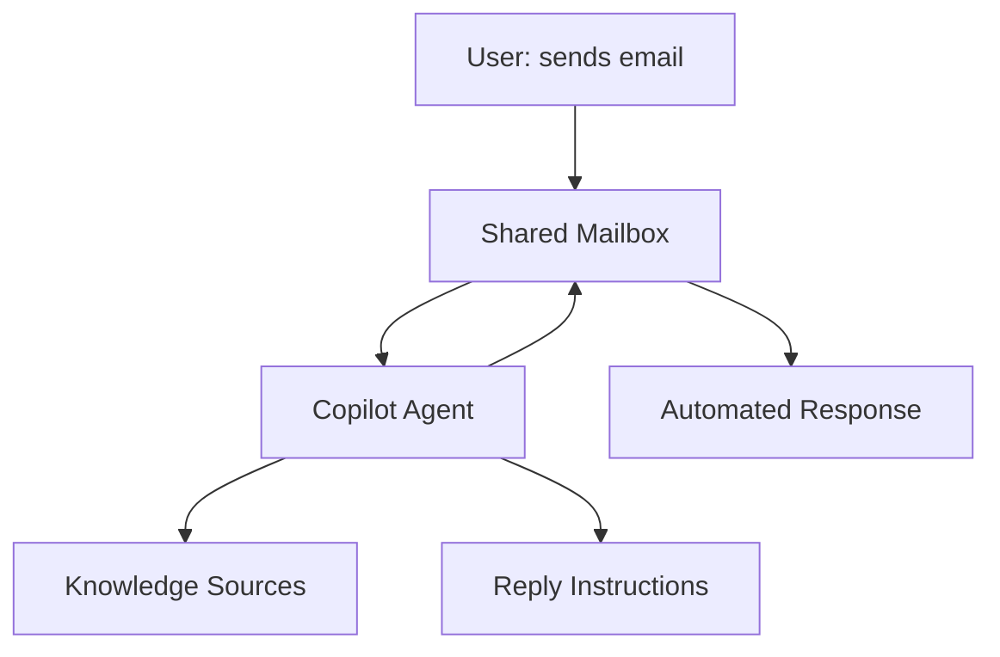
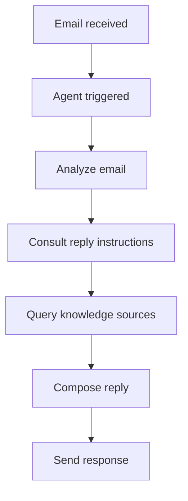
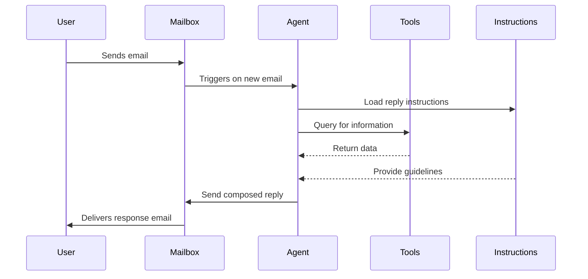

# MS65 Copilot Implementation Diagrams

## 1. Architecture Diagram

```mermaid
graph TD

	User[User: sends email]
	Mailbox[Shared Mailbox]
	Agent[Copilot Agent]
	Tools[Knowledge Sources]
	Instructions[Reply Instructions]
	Response[Automated Response]

	User --> Mailbox
	Mailbox --> Agent
	Agent --> Tools
	Agent --> Instructions
	Agent --> Mailbox
	Mailbox --> Response
```

---

## 2. Process Flowchart

```mermaid
flowchart TD
	A[Email received] --> B[Agent triggered]
	B --> C[Analyze email]
	C --> D[Consult reply instructions]
	D --> E[Query knowledge sources]
	E --> F[Compose reply]
	F --> G[Send response]
```

---

## 3. Sequence Diagram

```mermaid
sequenceDiagram
	participant User
	participant Mailbox
	participant Agent
	participant Tools
	participant Instructions

	User->>Mailbox: Sends email
	Mailbox->>Agent: Triggers on new email
	Agent->>Instructions: Load reply instructions
	Agent->>Tools: Query for information
	Tools-->>Agent: Return data
	Instructions-->>Agent: Provide guidelines
	Agent->>Mailbox: Send composed reply
	Mailbox->>User: Delivers response email
```
